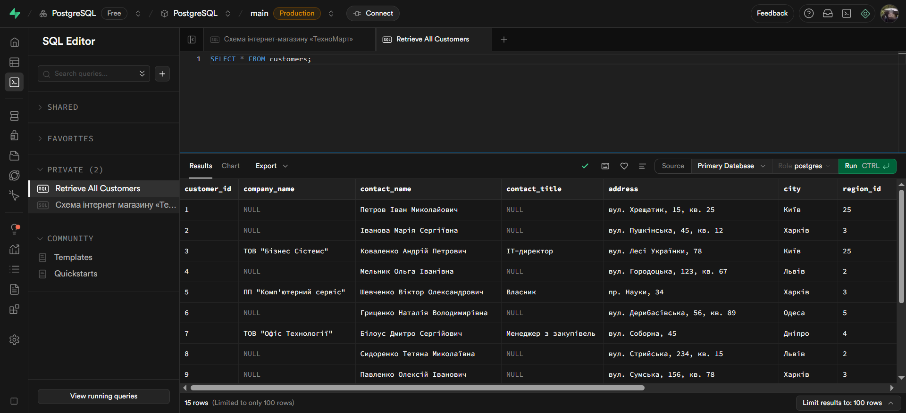
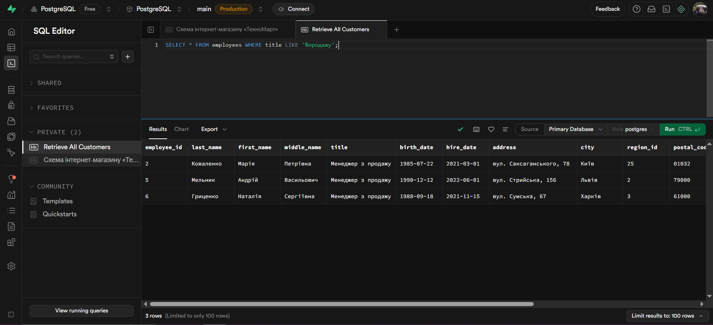
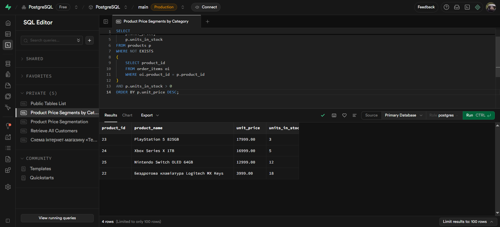
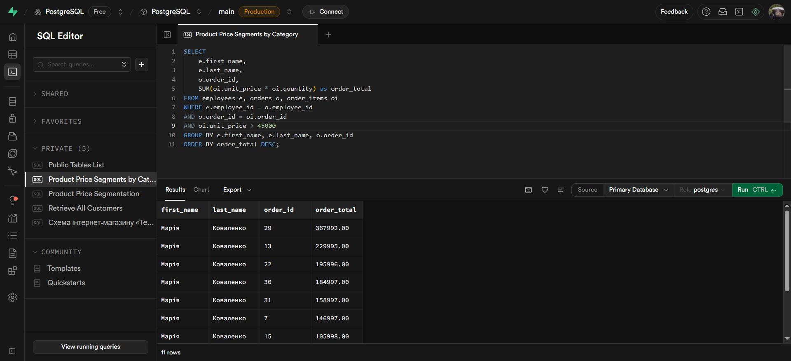

# Лабораторна робота 1. Робота з СУБД PostgreSQL та основи SQL

## Загальна інформація

**Здобувач освіти:** [Генелюк Назар]
**Група:** [32]
**Обраний рівень складності:** [3]
**Посилання на проєкт:** [https://supabase.com/dashboard/project/elricfjpuyutvdymvcak]

## Виконання завдань

### Список таблиць

Результат:У базі даних створено 8 основних таблиць: categories, customers, employees, order_items, orders, products, regions, suppliers.
А також 4 представлення: customer_orders_summary, employee_performance, monthly_sales_report, product_sales_summary.


### РІВЕНЬ 1.
### Отримати всі записи з таблиці customers.

```sql
SELECT * FROM customers;
```

Результат: Отримано усі поля з таблиці клієнтів.

### Вивести тільки назви товарів і їхні ціни з таблиці products.

```sql
SELECT product_name, unit_price
FROM products;
```

Результат: Отримано назву і ціну усіх продуктів з таблиці товарів.

### Показати контактні дані всіх співробітників (ім'я, прізвище, телефон, email).

```sql
SELECT first_name, last_name, phone, email
FROM employees;
```

Результат: Отримано контактну інформ. усіх співробітників.

### Знайти всіх клієнтів з міста Київ.

```sql
SELECT *
FROM customers
WHERE city = 'Київ';
```

Результат: Отримано клієнтів з міста Київ.

### Вивести товари, які коштують більше 25000 грн.

```sql
SELECT *
FROM products
WHERE unit_price > 25000;
```

Результат: Отримано товари, що коштують більше 25000 грн.

### Показати всі замовлення зі статусом 'delivered'.

```sql
SELECT *
FROM orders
WHERE order_status = 'delivered';
```

Результат: Отримано усі доставлені замолення.

### Знайти співробітників, які працюють у відділі продажів (посада містить слово "продаж").

```sql
SELECT *
FROM employees
WHERE title LIKE '%продажу';
```

Результат: Отримано співробітників, що містять у назві посади слово 'продаж'.

### Відсортувати товари за зростанням ціни.

```sql
SELECT *
FROM products
ORDER BY unit_price;
```

Результат: Отримано товари, що впорядковані за зрост. ціни.

### Показати клієнтів в алфавітному порядку за іменем контактної особи.

```sql
SELECT *
FROM customers
ORDER BY contact_name;
```

Результат: Отримано клієнтів впорядкованих в алфавітному порядку.

### Вивести замовлення від найновіших до найстаріших.

```sql
SELECT *
FROM orders
ORDER BY order_date DESC;
```

Результат: Отримано усі замовлення, що впорядковані по новизні.

### Показати перші 10 найдорожчих товарів.

```sql
SELECT *
FROM products
ORDER BY unit_price DESC
LIMIT 10;
```

Результат: Отримано 10 перших найдорожчих товарів.

### Вивести 5 останніх замовлень (за датою).

```sql
SELECT *
FROM orders
ORDER BY order_date DESC
LIMIT 5;
```

Результат: Отримано 5 останніх замовлень за датою.

### Отримати перших 8 клієнтів в алфавітному порядку.

```sql
SELECT *
FROM customers
ORDER BY contact_name
LIMIT 8;
```

Результат: Отримано 8 перших клієнтів в алфавітному порядку.


### РІВЕНЬ 2.
### Знайти всіх клієнтів, чиї імена починаються на "Іван".

```sql
SELECT *
FROM customers
WHERE contact_name LIKE 'Іван%';
```

Результат: Отримано 1 клієнта чиє ім'я починається на 'Іван'.

### Вивести товари, в назві яких є слово "phone" або "телефон".

```sql
SELECT *
FROM products
WHERE product_name LIKE '%Phone%'
OR product_name LIKE '%Телефон%';
```

Результат: Отримано товари в назві яких є слова 'phone' або 'телефон'.

### Самостійно: Придумати та виконати 3 власні запити з використанням LIKE для пошуку за різними зразками (початок, кінець, містить).

1.
```sql
SELECT *
FROM products
WHERE product_name LIKE 'Samsung%';
```

Результат: Отримано товари назва яких починається на 'Samsung'.

2.
```sql
SELECT *
FROM products
WHERE products_name LIKE '%GB';
```

Результат: Отримано товари назва яких закінчується на 'GB'.

3.
```sql
SELECT *
FROM products
WHERE product_name LIKE '%Air%';
```

Результат: Отримано товари в назві яких міститься слово 'Air'.

### Знайти товари дорожчі за 15000 грн і дешевші за 50000 грн.

```sql
SELECT *
FROM products
WHERE unit_price > 15000
AND unit_price < 50000;
```

Результат: Отримано товари дорожчі за 15000 та дешевші за 20000.

### Вивести клієнтів з Києва або Львова, які є юридичними особами.

```sql
SELECT *
FROM customers
WHERE customer_type = 'individual'
AND (city = 'Київ' OR city = 'Львів');
```

Результат: Отримано клієнтів з Києва або Львова, як є юридич. особами.

### Самостійно: Створити 4 власні запити з комбінаціями логічних операторів для різних таблиць.
1.
```sql
SELECT *
FROM employees
WHERE city = 'Київ'
AND (salary > 22000 AND salary < 40000);
```

Результат: Отримано співробітників з міста Київ, що мають зар. плату в діапазоні між 22000 грн. та 40000 грн.

2.
```sql
SELECT *
FROM orders
WHERE freight > 120
AND (ship_via = 'Нова Пошта' OR ship_via = 'Делівері');
```

Результат: Отримано замовлення вантаж яких вище за 120 та доставка виконується 'Новою поштою' або 'Делівері'.

3.
```sql
SELECT *
FROM products
WHERE units_in_stock >= 10
AND (product_name LIKe '%iPhone%' OR product_name LIKE '%Samsung%');
```

Результат: Отримано товари наявних на складі у кількості більше 10-ти, а також в назві яких є слова 'iPhone' або 'Samsung'.

4.
```sql
SELECT *
FROM suppliers
WHERE contact_name LIKE '%Директор%'
OR contact_name LIKE '%дирекор%';
```

Результат: Отримано постачальників в контакному імені яких слово 'директор'.

### Вивести клієнтів з міст Київ, Харків, Одеса, Дніпро.

```sql
SELECT *
FROM customers
WHERE city IN ('Київ', 'Харків', 'Одеса', 'Дніпро');
```

Результат: Отримано клієнтів з міст: Київ, Харків, Одеса та Дніпро.

### Знайти товари в ціновому діапазоні від 10000 до 30000 грн.

```sql
SELECT *
FROM products
WHERE unit_price BETWEEN 10000 AND 30000;
```

Результат: Отримано товари ціна яких варіюється в діапазоні між 10000 грн. та 30000 грн.

### Самостійно: Придумати та виконати по 2 запити для кожного оператора (IN, BETWEEN, IS NULL/IS NOT NULL).
1.(IN)
```sql
SELECT *
FROM orders
WHERE ship_via IN ('Нова Пошта', 'САТ');
```

Результат: Отримано замовлення що доставляються Новою Поштою або САТ.

2.(IN)
```sql
SELECT *
FROM employees
WHERE region_id ('2', '3', '5');
```

Результат: Отримано співробітників код регіону яких = 2, 3 або 5.

3.(BTW &)
```sql
SELECT *
FROM orders
WHERE order_date BETWEEN '2024-02-03' AND '2024-08-05';
```

Результат: Отримано замовлення що були оформлені між 2024-02-03 та 2024-08-05.

4.(BTW &)
```sql
SELECT *
FROM products
WHERE units_in_stock BETWEEN 15 AND 50;
```

Результат: Отримано товари яких на складі більше 15 та менше 50 шт.

5.(IS NULL)
```sql
SELECT *
FROM customers
WHERE company_name IS NULL;
```

Результат: Отримано клієнтів у яких не вказана назва компанії.

6.(IS NULL)
```sql
SELECT *
FROM products
WHERE unit_price IS NULL;
```

Результат: Отримано товари у яких не вказана ціна.

7.(IS NOT NULL)
```sql
SELECT *
FROM products
WHERE products_name IS NOT NULL;
```

Результат: Отримано товари у яких вказана назва.

8.(IS NOT NULL)
```sql
SELECT *
FROM customers
WHERE contact_title IS NOT NULL;
```

Результат: Отримано клієнтів у яких вказана посада.

### Самостійно: Створити 5 складних запитів, які поєднують різні типи умов (LIKE + AND/OR, BETWEEN + IN, тощо).
1.
```sql
SELECT *
FROM employees
WHERE last_name LIKE '%ко'
AND birth_date BETWEEN '1980-01-01' AND '1990-01-01'
AND city IN ('Харків', 'Київ');
```

Результат: Отримано співробітників що були народжені між 1980-01-01 та 1990-01-01 та з міста Харків або Київ.

2.
```sql
SELECT *
FROM products
WHERE
    product_name LIKE '%G%' AND product_name LIKE '%P%'
    AND unit_price BETWEEN 22000 AND 30000
    AND category_id IN ('1', '2'); 
```

Результат: Отримано товари в назві яких є літера 'G' та 'P' та їхня ціна в діапазоні між 22000 грн. та 30000 грн. і що належіть до категорій 1 або 2.

3.
```sql
SELECT *
FROM orders
WHERE
    order_status IN ('pending', 'processing', 'shipped')
    AND freight BETWEEN 100 AND 330
    OR (ship_via = 'САТ' AND order_status = 'delivered');
```

Результат: Отримано не доставлені замовлення вантаж яких більше 100 та менше 300, або вже був доставлений САТ.

4.
```sql
SELECT *
FROM customers
WHERE
    city IN ('Харків', 'Львів', 'Дніпро', 'Одеса')
    AND address LIKE '%a%'
    AND NOT customer_type = 'company'
    ANd registration_date BETWEEN '2023-02-20' AND '2023-05-20';
```

Результат: Отримано клієнтів з Харкова, Києва, Дніпра та Одеси, в адресі яких є буква 'а', які є юридичними особами, а також зареєстровані в системі з 2023-02-20 до 2023-05-20.

5.
```sql
SELECT *
FROM customer_orders_summary
WHERE 
    total_amount BETWEEN 20000 AND 70000
    AND total_orders IN (1, 2, 3, 4, 5)
    OR contact_name LIKE '%нко';
```

Результат: Отримано підсумок замовлень клієнтів сума замолень яких між 20000 грн. та 70000 грн. і кількість замолень яких рівна 1, 2, 3, 4 або 5, або контактне ім'я закінчується на 'нко'.

### Самостійно: Написати 3 запити з сортуванням за кількома полями та 2 запити з використанням OFFSET для пагінації.
1.(Sort)
```sql
SELECT *
FROM customer_orders_summary
ORDER BY
    customer_type, contact_name;
```

Результат: Отримано підсумок замолень клієнтів впорядкових за типом клієнта та його ім'ям.

2.(Sort)
```sql
SELECT *
FROM products
ORDER BY category_id DESC, unit_price ASC;
```

Результат: Отримано товари впорядковані за категорією та ціною.

3.(Sort)
```sql
SELECT *
FROM customers
ORDER BY company_name DESC, city, contact_name;
```

Результат: Отримано клієнтів впорядковних за назвою компанії, містом, та ім'ям.

4.(Offset)
```sql
SELECT *
FROM customers
ORDER BY company_name DESC, city, contact_name
OFFSET 6;
```

Результат: Отримано клієнтів впорядковних за назвою компанії, містом, та ім'ям, з відступом 6 рядів.

5.(Offset)
```sql
SELECT *
FROM customers
ORDER BY company_name DESC, region_id
LIMIT 5
OFFSET 5;
```

Результат: Отримано клієнтів продякованих за назвою компанії та кодом регіону, з лімітом в 5 рядів та відступом 5 рядів.


### РІВЕНЬ 3.
### Знайти товари, в назві яких є "Samsung" або "Apple", але немає слова "чохол".

```sql
SELECT *
FROM products
WHERE
    product_name LIKE '%Samsung%'
    OR product_name LIKE '%Apple%'
    AND prodcut_name NOT LIKE '%чохол%';
```

Результат: Отримано товари в назві яких є слово 'Samsung' або 'Apple', але немає слова 'чохол'.

### Самостійно: Створити 4 власні складні запити з комбінаціями LIKE та логічних операторів.
1.
```sql
SELECT *
FROM orders
WHERE
    ship_via LIKE '%Нова Пошта%'
    AND NOT ship_city LIKE 'Київ%'
    AND order_status = 'delivered'
    AND freight > 100;
```

Результат: Отримано доставлені замовлення з вантажем більше 100, але доставлені не в Київ.

2.
```sql
SELECT *
FROM customers
WHERE
    email LIKE '%@gmail.com'
    AND NOT city LIKE 'Львів%'
    AND customer_type = 'individual';
```

Результат: Отримано клієнтів пошта яких закінчується на @gmail.com, і місто не містить слово 'Львів', і тип клієнта юридична особа. 

3.
```sql
SELECT *
FROM products
WHERE
    (product_name LIKE '%Apple%' OR product_name LIKE '%iPhone%' OR product_name LIKe '%iPad%')
    AND NOT product_name LIKe '%кабель'
    AND unit_price < 30000;
```

Результат: Отримано товари в назві яких є слова 'Apple', 'iPhone' або 'iPad', але немає слова 'кабель' та ціна товару менша 30000 грн. 

4.
```sql
SELECT *
FROM orders
WHERE
    ship_via LIKE '%УкрПошта%'
    AND NOT order_status LIKE 'processing'
    AND order_date >= '2024-01-01';
```

Результат: Отримано замовлення що доставляються УкрПоштою і не в обробці та були замовлені після 2024-01-01.

### Знайти товари дорожчі 20000 грн (категорії 1 або 2) АБО товари дешевші 5000 грн будь-якої категорії.

```sql
SELECT *
FROM products
WHERE
    (unit_price > 20000 AND (category_id = 1 OR category_id = 2))
    OR unit_price < 50000;
```

Результат: Отримано товари дорожчі 20000 грн. категорій 1 або 2, або товари дешевші за 50000 грн.

### Самостійно: Написати 3 запити з складними вкладеними умовами, використовуючи дужки для групування логіки.
1.
```sql
SELECT *
FROM products
WHERE
    (unit_price > 30000 AND (category_id = 2 OR category_id = 3))
    OR (units_in_stock > 20 AND supplier_id IN (5, 6, 7));
```

Результат: Отримано товари товари ціна яких більше 30000 і вони належать до категорій 2 або 3, або товари яких наявних на складі більше 20 і код постачальника = 5, 6, 7.

2.
```sql
SELECT *
FROM orders
WHERE
    (shipped_via IS NULL AND order_status != 'delivered' AND required_date > '2024-07-19')
    OR (ship_via IN ('Нова Пошта', 'Делівері') AND ship_city IN ('Київ', 'Львів'));
```

Результат: Отримано замовлення метод доставки яких не зазначений, які ще не доставлені і замовлення було оформлено після 2024-07-19, або доставляється Новою Поштою, Делівері і місто доставки Київ або Львів.

3.
```sql
SELECT *
FROM suppliers
WHERE
    ((company_name LIKE 'ТОВ%' OR company_name LIKE 'ПП%') AND city IN ('Київ', 'Львів', 'Харків', 'Дніпро'))
    OR email LIKE '%electronic%'
    ORDER BY contact_name;
```

Результат: Отримано постачальників назва яких містить префікси 'ТОВ' або 'ПП' та місто входить до: Київ, Львів, Харків, Дніпро. Або пошта містить слово 'electronic' та відсортовано за контактним ім'ям.

### Самостійно: Створити звіт товарів з 5+ різними умовами фільтрації одночасно.

```sql
SELECT
    product_name,
    category_id,
    supplier_id,
    unit_price,
    units_in_stock,
    reorder_level
FROM products
WHERE
    unit_price BETWEEN 20000 ANd 60000
    AND units_in_stock > 5
    AND category_id IN (1, 2, 3)
    AND discontinued = FALSE
    AND reorder_level >= 5
    AND product_name NOT LIKE '%AMD%';
```

Результат: Отримано товари в ціновому діапазоні між 20000 та 60000 наявності на складі, категорії, знижці, рівні повторного замовлення та назва товару не має містити 'AMD'.

### Самостійно: Написати запит для аналізу клієнтської бази з множинними критеріями відбору.

```sql
SELECT
    contact_name,
    customer_type,
    city
FROM customers
WHERE
    (customer_type = 'company' AND city IN ('Київ', 'Дніпро'))
    OR (customer_type = 'individual' AND city IN ('Львів', 'Одеса') AND registration_date > '2023-01-01');
```

Результат: Отримано звіт про клієнтську базу що показує ім'я клієнта, його тип та місто.

### Самостійно: Провести аналіз товарів за ціновими сегментами (створити 3+ запити).

```sql
SELECT
    product_name,
    unit_price,
    CASE
        WHEN unit_price < 10000 THEN 'Бюджетний'
        WHEN unit_price BETWEEN 10001 AND 30000 THEN 'Середній'
        ELSE 'Преміум'
    END AS segment
FROM products
ORDER BY segment
```

Результат: Отримано звіт по ціновим категоріям товарів, що вказує назву товару його ціну та один сегмент з трьох до кожного товару.

### Самостійно: Дослідити розподіл клієнтів за географічним принципом (4+ запити).

```sql
SELECT
    contact_name,
    customer_type,
    city,
    CASE
        WHEN city IN ('Київ', 'Харків', 'Львів') THEN 'Клієнт великого міста'
        ELSE 'Регіональний клієнт'
    END AS segment
FROM customers
ORDER BY
    segment,
    customer_type DESC,
    contact_name;
```

Результат: Отримано звіт по клієнтам, що вказує ім'я клієнта, його тип, місто та який це клієнт.

### Самостійно: Проаналізувати часові патерни в замовленнях (3+ запити).

```sql
SELECT
    CASE
        WHEN order_date BETWEEN '2023-12-01' AND '2024-02-29' THEN 'Зима'
        WHEN order_date BETWEEN '2024-03-01' AND '2024-05-31' THEN 'Весна'
        WHEN order_date BETWEEN '2024-06-01' AND '2024-08-31' THEN 'Літо'
        WHEN order_date BETWEEN '2024-09-01' AND '2024-11-30' THEN 'Осінь'
    END AS season,
    COUNT(*) AS order_count
FROM orders
GROUP BY season
```

Результат: Отримано статистику замовлень по сезонам року. Кількість замовлень за кожну пору року де їх можна порівняти.

### Самостійно: Придумати та реалізувати 5 нестандартних запитів, які демонструють глибоке розуміння SQL логіки.
1.
```sql
SELECT 
    p.product_id,
    p.product_name,
    p.unit_price,
    p.units_in_stock
FROM products p
WHERE NOT EXISTS
(
    SELECT product_id
    FROM order_items oi
    WHERE oi.product_id = p.product_id
)
AND p.units_in_stock > 0
ORDER BY p.unit_price DESC;
```

Результат: Отримано список найдорожчих товарів, які є на складі, але ніколи не були замовлені.

2.
```sql
SELECT 
    e.first_name,
    e.last_name,
    o.order_id,
    SUM(oi.unit_price * oi.quantity) as order_total
FROM employees e, orders o, order_items oi
WHERE e.employee_id = o.employee_id
AND o.order_id = oi.order_id
AND oi.unit_price > 45000
GROUP BY e.first_name, e.last_name, o.order_id
ORDER BY order_total DESC;
```

Результат: Список замовлень, які містять позиції з ціною понад 45000 грн., з показом загальної суми цих дорогих позицій для кожного замовлення

3.
```sql
SELECT 
    c.category_name,
    COUNT(p.product_id) as products_count,
    COALESCE(SUM(oi.quantity), 0) as total_sold
FROM categories c
LEFT JOIN products p ON c.category_id = p.category_id
LEFT JOIN order_items oi ON p.product_id = oi.product_id
GROUP BY c.category_name
ORDER BY total_sold;
```

Результат: Отримано аналіз продажів по категоріях товарів, включаючи категорії без продажів.

4.
```sql
SELECT 
    s.company_name,
    MAX(p.unit_price) as max_price,
    AVG(p.unit_price) as avg_price,
    COUNT(p.product_id) as products_count
FROM suppliers s
JOIN products p ON s.supplier_id = p.supplier_id
GROUP BY s.company_name
HAVING MAX(p.unit_price) > 30000
ORDER BY max_price DESC;
```

Результат: Відсортовано від постачальника з найдорожчим товаром до того, у кого максимальна ціна найменша (але все ще понад 30,000).

5.
```sql
SELECT 
    c.category_name,
    p.product_name,
    p.unit_price
FROM categories c
JOIN products p ON c.category_id = p.category_id
WHERE p.unit_price = (
    SELECT MIN(p2.unit_price) 
    FROM products p2 
    WHERE p2.category_id = c.category_id
)
ORDER BY c.category_name;
```

Результат: Для кожної категорії повертає найдешевший товар


## Висновки

**Самооцінка**: [5]

**Обгрунтування**: [Я вважаю, що виконав усі завдання коректно і розумію що там написано.]