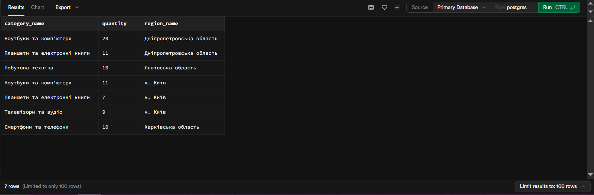
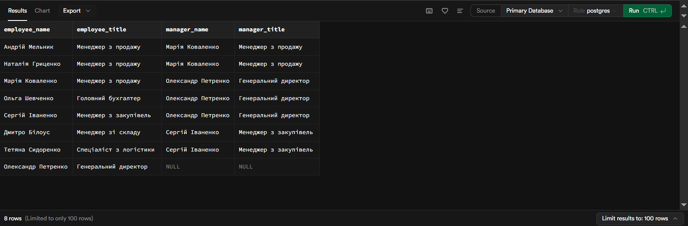
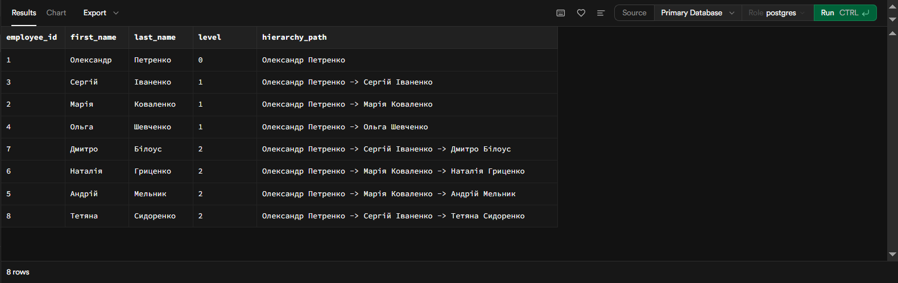

# Лабораторна робота 2. Створення складних SQL запитів

## Загальна інформація

**Здобувач освіти:** [Генелюк Назар]
**Група:** [32]
**Обраний рівень складності:** [3]

## Виконання завдань

### Рівень 1

#### 1. З'єднання таблиць

**Завдання 1.1:** INNER JOIN - список товарів з категоріями та постачальниками

```sql
select product_name, unit_price, category_name, company_name
from products p
join categories c on p.category_id = c.category_id
join suppliers s on s.supplier_id = p.supplier_id;
```

**Результат виконання:**


**Пояснення:** Запит приєднує до таблиці продуктів таблиці категорій та постачальників. І потім виводить назву продукта, його ціну, назву категорії та постачальника.


**Завдання 1.2:** LEFT JOIN - клієнти з кількістю замовлень

```sql
select
  contact_name,
  count(o.order_id) as order_count
from customers c
left join orders o on c.customer_id = o.customer_id
group by c.customer_id;
```

**Результат виконання:**


**Пояснення:** Запит приєднує до таблиці клієнтів таблицю замовлень, потім рахує кількість замовлень на ідентифікатор кожного клієнта.


**Завдання 1.3:** Множинне з'єднання - детальна інформація про замовлення

```sql
select
  p.product_name,
  oi.unit_price,
  o.ship_via,
  e.first_name,
  e.last_name
from order_items oi
join products p on oi.product_id = p.product_id
join orders o on oi.order_id = o.order_id
join employees e on o.employee_id = e.employee_id;
```

**Результат виконання:**


**Аналіз складності:** Складність запиту - середня. 4 таблиці в JOIN операціях, різноманітні типи даних (продукти, замовлення, співробітники), order_items як зв'язуюча ланка.
Запит витягує назви товарів з таблиці товарів, ціни з order_items, спосіб доставки з orders та імена співробітників, які обробили замовлення.


#### 2. Агрегатні функції

**Завдання 2.1:** Статистика товарів за категоріями

```sql
select 
  p.product_name,
  p.unit_price,
  c.category_name,
  count(oi.order_id) as order_count,
  sum(oi.quantity) as units_ordered,
  round(avg(oi.discount), 3) as avg_discount,
  max(oi.quantity) as max_in_single_order,
  min(oi.quantity) as min_in_single_order
from
  products p
join categories c on p.category_id = c.category_id
join order_items oi on p.product_id = oi.product_id
group by
  p.product_name,
  p.unit_price,
  c.category_name
order by order_count desc;
```

**Результат виконання:**


**Пояснення:** Запит дістає з таблиці товарів назву і ціну, з таблиці категорій назву категорії, з таблиці order_items к-сть замовлень певного товару, скільки всього товару було продано, середню снижку на певний товар, макс і мін одиниць замовлених за один раз.

**Завдання 2.2:** Продажі за регіонами з використанням HAVING

```sql
select
  c.category_name,
  sum(oi.quantity) as quantity,
  r.region_name

from
  categories c
  
join products p on p.category_id = c.category_id
join order_items oi on p.product_id = oi.product_id
join orders o on o.order_id = oi.order_id
join regions r on o.ship_region_id = r.region_id
group by c.category_name, r.region_name
having sum(oi.quantity) > 5
order by r.region_name, category_name;
```

**Результат виконання:**


**Пояснення:** Запит показує, яка кількість товарів кожної категорії була продана в кожному регіоні доставки. Результати групуються за назвою категорії та регіону.

**Завдання 2.3:** Постачальники з кількістю товарів більше 2

```sql
select
  s.company_name,
  COUNT(p.product_id) as product_count
from suppliers s
join products p on s.supplier_id = p.supplier_id
group by s.supplier_id, s.company_name
having COUNT(p.product_id) > 2
order by product_count desc;
```

**Результат виконання:**


**Пояснення:** Запит виводить постачальника та рахує його кількість товарів, але виводить лише тих в яких товарів більше двох.

#### 3. Базові підзапити

**Завдання 3.1:** Товари з ціною вище середньої по категорії

```sql
select
  p.product_name,
  p.unit_price,
  c.category_name,
  (select round(avg(p2.unit_price), 2)
   from products p2
   where p2.category_id = p.category_id) as avg_category_price
from products p
JOIN categories c ON p.category_id = c.category_id
where p.unit_price > (select AVG(p2.unit_price)
                     from products p2
                     where p2.category_id = p.category_id)
order by c.category_name, p.unit_price desc;
```

**Результат виконання:**


**Завдання 3.2:** Клієнти з замовленнями у 2024 році

```sql
select 
    customer_id,
    company_name,
    contact_name,
    city
from customers
where customer_id in (
    select distinct customer_id
    from orders
    where extract(year from order_date) = 2024
);
```

**Результат виконання:**


**Завдання 3.3:** Товари з загальною кількістю продажів

```sql
select
  p.product_name,
  p.unit_price,
  (select sum(oi.quantity)
  from order_items oi
  where (oi.product_id = p.product_id)) as total_sales
from products p
order by total_sales desc nulls last;
```

**Результат виконання:**


### Рівень 2

#### 4. Складні з'єднання

**Завдання 4.1:** RIGHT JOIN - аналіз категорій та товарів

```sql
select
  c.category_name,
  p.product_name,
  p.unit_price,
  p.units_in_stock
from products p
right join categories c on p.category_id = c.category_id
order by c.category_name, p.product_name;
```

**Результат виконання:**


**Завдання 4.2:** Self-join - співробітники та керівники

```sql
select
  e.first_name || ' ' || e.last_name as employee_name,
  e.title as employee_title,
  m.first_name || ' ' || m.last_name as manager_name,
  m.title as manager_title
from employees e
left join employees m on e.reports_to = m.employee_id
order by manager_name, employee_name;
```

**Результат виконання:**


#### 5. Віконні функції

**Завдання 5.1:** Ранжування товарів за ціною в категоріях

```sql
select
  product_name,
  unit_price,
  category_name,
  rank() over (partition BY c.category_name order BY p.unit_price desc) as rank_position,
  dense_rank() over (partition BY c.category_name order BY p.unit_price desc) as dense_rank_position,
  row_number() over (partition BY c.category_name order BY p.unit_price desc) as row_num_position
from products p
join categories c on p.category_id = c.category_id
```

**Результат виконання:**


**Завдання 5.2:** Порівняння замовлень з попередніми датами

```sql
select
    order_date,
    freight,
    lag(freight, 1, 0) over (order by order_date) as prev_freight,
    lead(freight, 1, 0) over (order by order_date) as next_freight
from orders
order by order_date;
```

**Результат виконання:**


### Рівень 3

#### 6. Матеріалізовані представлення та рекурсивні запити

**Завдання 6.1:** Матеріалізоване представлення для аналізу продажів

```sql
create materialized view sales_analysis as
select
    extract(year from o.order_date) as sales_year,
    extract(month from o.order_date) as sales_month,
    p.product_name,
    c.category_name,
    p.unit_price,
    sum(oi.quantity) as total_sold
from products p
join order_items oi on p.product_id = oi.product_id
join orders o on o.order_id = oi.order_id
join categories c on p.category_id = c.category_id
group by
    extract(year from o.order_date),
    extract(month from o.order_date),
    p.product_name,
    c.category_name,
    p.unit_price
ORDER BY sales_year DESC, sales_month DESC;
```

**Результат виконання:**


**Пояснення:** Переваги використання матеріалізованих представлень заключаються в тому, що вони зменшують навантаження на базу даних зберігаючи результат виконання складного запиту.

**Завдання 6.2:** Рекурсивний запит для ієрархії співробітників

```sql
with recursive employee_hierarchy as
(
    select employee_id, first_name, last_name, reports_to,
           0 as level,
           first_name || ' ' || last_name as hierarchy_path
    from employees
    where reports_to is null

    union all

    select e.employee_id, e.first_name, e.last_name, e.reports_to,
           eh.level + 1,
           eh.hierarchy_path || ' -> ' || e.first_name || ' ' || e.last_name
    from employees e
    join employee_hierarchy eh ON e.reports_to = eh.employee_id
    where eh.level < 10
)
select employee_id, first_name, last_name, level, hierarchy_path
from employee_hierarchy
order by level, last_name;
```

**Результат виконання:**


**Пояснення:** Спочатку запит вибирає співробітників без звітів ти позначає стартову точку рекурсії '0 as level'. Перша ітерація бере співробітників з базового випадку та знаходить всіх хто їх підпорядковані. В другій вже беруться співробітники з першої та знову шукаються підпорядковані і так доки рекурсія не зупиниться за умови 'where eh.level < 10'.

**Завдання 6.3:** Створити запит з динамічним SQL або збереженою процедурою для параметризованої аналітики

**Функція**
```sql
create or replace function get_region_customer_count
(
    target_region_id integer, 
    start_date date, 
    end_date date
)
returns integer
language sql
as $$
    select
        count(distinct o.customer_id)
    from orders o
    join customers c on o.customer_id = c.customer_id
    where c.region_id = target_region_id
      and o.order_date between start_date and end_date
      and o.order_status != 'cancelled';
$$;
```

**Виклик функції**
```sql
select get_region_customer_count(3, '2023-01-01', '2024-05-20');
```

**Результат виконання:**


**Пояснення** Запит створює функцію в якій задається тип і к-сть параметрів. Вона викликається за допомогою 'select get_region_customer_count();' та підраховує кількість унікальних клієнтів, які зробили замовлення з певного регіону за вказаний період часу.

**Самооцінка**: [5]

**Обгрунтування**: [Я зможу пояснити логіку цих запитів]
